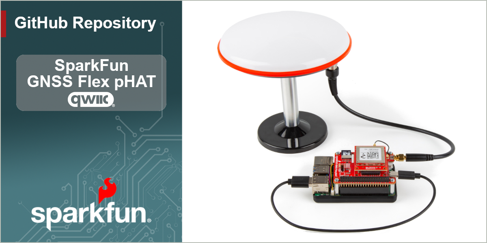

SparkFun GNSS Flex pHAT
========================================

The SparkFun GNSS Flex pHAT is a Raspberry Pi pHAT that functions as a *carrier board* for our SparkPNT GNSS Flex modules. With pre-soldered headers, no soldering is required to stack the pHAT on the headers of a Raspberry Pi, NVIDIA Jetson Nano, Google Coral, or other single-board computer with a similar 40-pin header.

The GNSS Flex pHAT also comes populated with two sets of 2x10 pin, 2mm pitch male headers for attaching a GNSS Flex module. With these headers, the GNSS Flex system is designed to be modular so that boards are pin-compatible for upgrades and can be easily swapped for repairs. Depending on the capabilities of the GNSS Flex module that is connected, these pins will breakout the USB, UART (x4), I2C, and SD card interfaces for the GNSS receiver along with any PPS or event signals, using a standardized pin out.

> [!NOTE]
> By default, we use the Raspberry Pi's primary serial bus *(i.e. **TX:** `GPIO14`/Pin `8`; **RX:** `GPIO15`/Pin `9`)* to communicate with the GNSS receiver of the SparkPNT GNSS Flex module. However, users can also utilize any of the other interfaces.

> [!IMPORTANT]
> Depending on the GNSS Flex module, this product will likely require an external antenna:
>
> - Be sure to check out the hookup guide for more information on the GNSS Flex module.
> - Users can also find [GNSS Antennas](https://www.sparkfun.com/gnss/gnss-antennas.html) in our catalog.
>
> Users will have two options for connecting an external GNSS antenna to their GNSS receiver.
>
> - The GNSS Flex modules will usually come with a U.FL connector for external antenna.
> - For a sturdier connection, an SMA connector is available on the SparkFun GNSS Flex pHAT that is bridged to an U.FL connector. Users simply need to jumper the U.FL connectors on both the SparkPNT GNSS Flex module and SparkFun GNSS Flex pHAT with a short U.FL cable.

> [!TIP]
> The SparkFun GNSS Flex pHAT has been tested and verified on the following platforms:
> - [Raspberry Pi](https://www.sparkfun.com/development-boards/single-board-computers/raspberry-pi/raspberry-pi-boards.html): 3B, 3B+, 3A+, Zero 2W, 4B, 5B
> - [NVidia Jetson Orin Nano](https://www.sparkfun.com/nvidia-jetson-orin-nano-developer-kit.html)

Documentation
--------------
- **[Hookup Guide (mkdocs)](http://docs.sparkfun.com/SparkFun_GNSS_Flex_System/)** - A hookup guide for the entire ecosystem of SparkFun GNSS Flex carrier boards and SparkPNT GNSS Flex modules, hosted by GitHub pages. 
   

Repository Contents
-------------------
- **[/docs](/docs/)** - Online documentation files
  - [/assets](/docs/assets/) - Assets files
    - [/3d_model](/docs/assets/3d_model/) - Files for the 3D models
      - [/3D CAD Model](/docs/assets/3d_model/cad_model.step) (.step)
    - [/board_files](/docs/assets/board_files/) - Files for the product design
      - [KiCad Design Files](/docs/assets/board_files/kicad_files.zip) (.zip)
      - [Schematic](/docs/assets/board_files/schematic.pdf) (.pdf)
      - [Dimensions](/docs/assets/board_files/dimensions.pdf) (.pdf)
    - [/component_documentation](/docs/assets/component_documentation/) - Datasheets for hardware components
    - [/img/hookup_guide/](/docs/assets/img/hookup_guide/) - Images for hookup guide documentation
- **[/Hardware](/Hardware/)** - Hardware design files (.brd, .sch)
  - **[/Production](/Production/)** - Production files

Product Variants
----------------
- [GPS-28137](https://www.sparkfun.com/sparkfun-gnss-flex-phat.html) - GNSS Flex pHAT *(only)*
- Kits:
  - [GPS-28766](https://www.sparkfun.com/sparkfun-gnss-flex-phat-mosaic-x5.html) - w/ the Septentrio mosaic-X5 GNSS Flex module
  - [GPS-28929](https://www.sparkfun.com/sparkfun-gnss-flex-phat-lg290p.html) - w/ the Quectel LG290P GNSS Flex module

Version History
---------------
- [v10](https://github.com/sparkfun/SparkFun_GNSS_pHAT/releases/tag/v10) - Initial Release

License Information
-------------------

This product is ***open source***!

Please review the [`LICENSE.md`](./LICENSE.md) file for license information.

If you have any questions or concerns about licensing, please contact technical support on our [SparkFun forums](https://forum.sparkfun.com/viewforum.php?f=152).

Distributed as-is; no warranty is given.

- Your friends at SparkFun.
