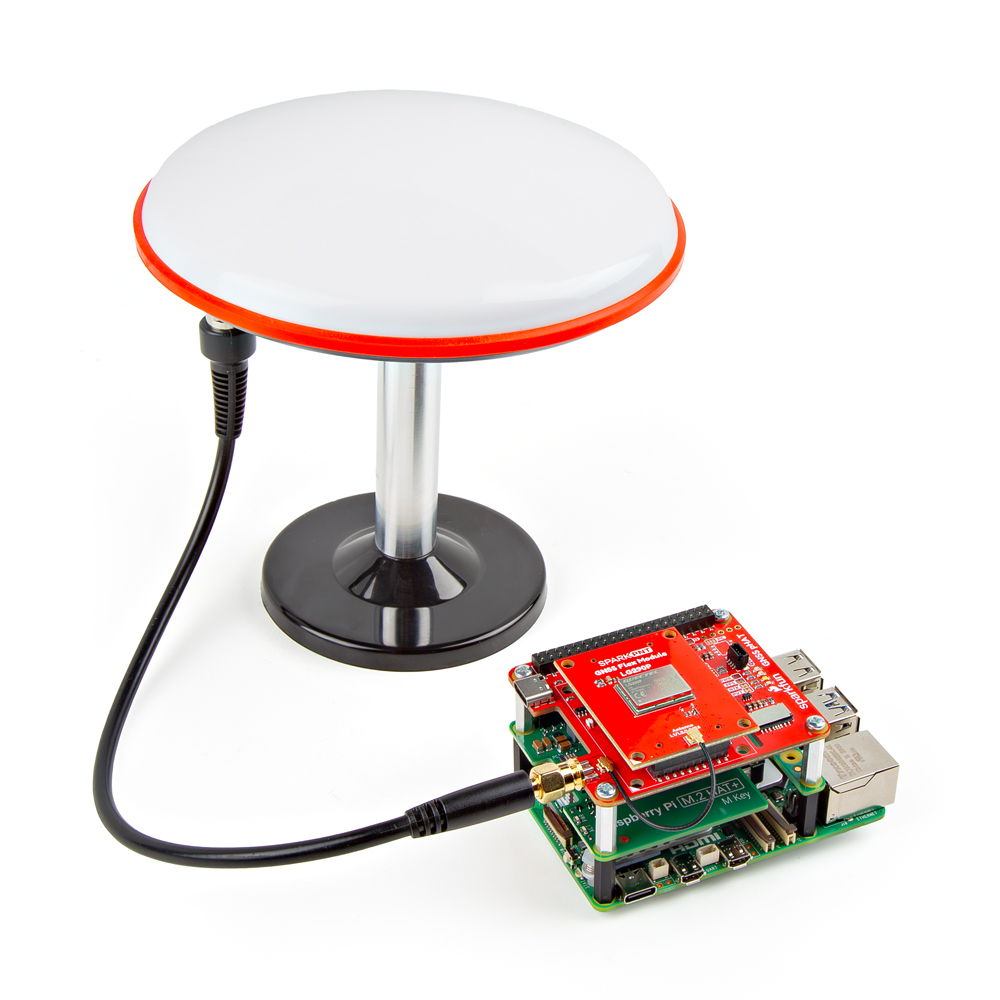

??? rpi "Raspberry Pi - Specific Instructions"
	The instructions below are specific to the Raspberry Pi and similar style SBCs. For other platforms, users should take into account the mechanical requirements of the SBC they are utilizing. For example, when interfacing the Nvidia Jetson Orin Nano, the pHAT will extend outside of the Jetson's footprint and can't be secured to the base.

	<figure markdown>
	[{ width="400" }](./assets/img/hookup_guide/assembly-jetson_nano.jpg "Click to enlarge")
	<figcaption markdown>Setting up the GNSS Flex pHAT kit with a Nvidia Jetson Orin Nano.</figcaption>
	</figure>

??? tip "Kit Components"
	Below, are the minimum parts that users will need to assemble the GNSS Flex pHAT on a Raspberry Pi or similar SBC.

	

	

	<figure markdown>
	[{ width="400" }](./assets/img/hookup_guide/assembly-parts.png "Click to enlarge")
	<figcaption markdown>The accessories included in addition to the GNSS Flex module, as part of the GNSS Flex pHAT kit.</figcaption>
	</figure>

	

	

	**Parts List**

	---

	- x1 - [SparkFun GNSS Flex pHAT](https://www.sparkfun.com/sparkfun-gnss-flex-phat.html)
	- x1 - [Tall GPIO Female Headers - 2x20 Pin](https://www.sparkfun.com/tall-gpio-female-headers-2x20-pin.html)
	- x1 - 50mm U.FL to U.FL Cable
	- x4 - Aluminum Hex Standoff
		- Thread: M2.5-0.45; Length: 16mm
	- x8 - Phillips Machine Screw
		- Thread: M2.5-0.45x8mm

	

	

## External Antenna
In order to receive [GNSS](https://en.wikipedia.org/wiki/Satellite_navigation "Global Navigation Satellite System") signals, users will need a compatible antenna. For the best performance, we recommend an active, L1/L2/L5/L6 GNSS antenna.

<figure markdown>
[{ width="400" }](./assets/img/hookup_guide/assembly-antenna.jpg "Click to enlarge")
<figcaption markdown>Connecting an antenna to the GNSS Flex pHAT.</figcaption>
</figure>

### Connection Options
There are two options for connecting an external antenna to a GNSS Flex module:

- An external antennas can be connected through the U.FL connector on the GNSS Flex board.
- However, for a sturdier connection, there is a signal pass-through between the U.FL and SMA antenna connectors on the GNSS Flex pHAT. To utilize the SMA connector, user can bridge the U.FL connections of the boards with a U.FL cable.

<figure markdown>
[{ width="400" }](./assets/img/hookup_guide/assembly-sma_adapter.jpg "Click to enlarge")
<figcaption markdown>Attaching an antenna directly to the GNSS Flex module with an adapter cable.</figcaption>
</figure>

<figure markdown>
[{ width="400" }](./assets/img/hookup_guide/assembly-ufl_bridge.jpg "Click to enlarge")
<figcaption markdown>Bridging the U.FL connections of the boards, to utilize the SMA connector on the GNSS Flex pHAT.</figcaption>
</figure>

### Antenna Bridge
The antenna bridge on the GNSS Flex pHAT can be utilized to connect an external antenna to the SMA connector. For the connection to work, an U.FL cable needs to bridge the antenna connection from the GNSS Flex module to the GNSS Flex pHAT. Due to the space constraint, we recommend connecting the U.FL cable to the GNSS Flex pHAT before attaching the GNSS Flex module to the pHAT.

<figure markdown>
[{ width="400" }](./assets/img/hookup_guide/assembly-ufl-1.jpg "Click to enlarge")
<figcaption markdown>Step 1 - Connect the U.FL cable to the GNSS Flex pHAT.</figcaption>
</figure>

<figure markdown>
[{ width="400" }](./assets/img/hookup_guide/assembly-flex_module.jpg "Click to enlarge")
<figcaption markdown>Step 2 - Attach the GNSS Flex module to the pHAT.</figcaption>
</figure>

<figure markdown>
[{ width="400" }](./assets/img/hookup_guide/assembly-ufl-2.jpg "Click to enlarge")
<figcaption markdown>Step 3 - Connect the other end of the U.FL cable to the GNSS Flex module.</figcaption>
</figure>

<figure markdown>
[{ width="400" }](./assets/img/hookup_guide/assembly-ufl-3.jpg "Click to enlarge")
<figcaption markdown>A U.FL cable bridging the antenna connection between the boards.</figcaption>
</figure>

## Attach Module
The GNSS Flex system is a modular ecosystem designed around two 2x10-pin, 2mm pitch headers, so boards are pin-compatible for upgrades and easily swapped for repairs. Users simply, stack a SparkPNT GNSS Flex module onto the headers of its associated *carrier* board.

!!! tip "SMA Connector"
	When bridging the antenna connection to the SMA connector of the GNSS Flex pHAT, we recommend attaching the U.FL cable to the pHAT before the GNSS Flex module.

<figure markdown>
[{ width="400" }](./assets/img/hookup_guide/assembly-flex_module.jpg "Click to enlarge")
<figcaption markdown>Attaching a GNSS FLex module to the GNSS Flex pHAT.</figcaption>
</figure>

### Board Alignment
The alignment indicator for mating these boards, is annotated with a triangle in the corner of the mating area.

<figure markdown>
[{ width="400" }](./assets/img/hookup_guide/assembly-animation.gif "Click to enlarge")
<figcaption markdown>The alignment and connection of a SparkPNT GNSS Flex module on top of a *carrier* board.</figcaption>
</figure>

## Assemble pHAT
Before assembling the mechanical hardware for the GNSS Flex pHAT, users should consider how the hardware will interface with their Raspberry Pi or other SBC.

- Attach the extension header to the Raspberry Pi or other single-board computer
- Attach the screws and standoffs to the SparkFun GNSS Flex pHAT
	1. To make things easier, we recommend attaching the standoffs to the pHAT first
	1. Once attached, users can stack the pHAT onto the Raspberry Pi or other single-board computer
	1. For a more permanent installation, users can also secure the pHAT to the SBC from the base

### Header Extension
When assembling the GNSS Flex pHAT, users should utilize the extension header that best suits their needs.

<figure markdown>
[{ width="400" }](./assets/img/hookup_guide/assembly-header.jpg "Click to enlarge")
<figcaption markdown>Attaching the extension header to the GPIO pins on a Raspberry Pi.</figcaption>
</figure>

!!! tip "Stacking Multiple HATs"
	

	

	<figure markdown>
	[{ width="400" }](./assets/img/hookup_guide/assembly-SSD_HAT.jpg "Click to enlarge")
	<figcaption markdown>Using different extension headers to stack multiple HATs on a Raspberry Pi.</figcaption>
	</figure>

	

	

	**Selecting an Extension Header**

	---

	- [Tall GPIO Female Headers - 2x20 Pin](https://www.sparkfun.com/tall-gpio-female-headers-2x20-pin.html)
		- These are the same extension headers included in our GNSS Flex pHAT kits.
		- These headers are just long enough to attach a Raspberry Pi HAT/pHAT and are great if you are looking to maximize the amount of airflow beneath the pHAT.
	- [Extended GPIO Female Header - 2x20 Pin (16mm/7.30mm)](https://www.sparkfun.com/extended-gpio-female-header-2x20-pin-16mm-7-30mm.html)
		- These headers offer the most structural support and are long enough for stacking multiple HATs, but with the spacers it's just a little too tall to match the height of the standoffs in the kit.
	- [Extended GPIO Female Header - 2x20 Pin (13.5mm/9.80mm)](https://www.sparkfun.com/extended-gpio-female-header-2x20-pin-13-5mm-9-80mm.html)
		- These headers are great if users want to stack multiple Raspberry Pi HAT/pHATs.

	

	

### Standoffs
The standoffs included in the GNSS Flex pHAT kits offer structural support and ventilation space, for attaching the board to a Raspberry Pi. However, an extension header must be used in order to maintain the pin connections of the 40-pin GPIO header from the Raspberry Pi.

When connecting the standoffs, we recommend attaching them to the GNSS Flex pHAT first. However, users should leave the screws a little loose to account for minor tolerances in the mechanical assembly.

<figure markdown>
[{ width="400" }](./assets/img/hookup_guide/assembly-standoffs-1.jpg "Click to enlarge")
<figcaption markdown>Attaching the standoffs to the GNSS Flex pHAT with a screwdriver.</figcaption>
</figure>

<figure markdown>
[{ width="400" }](./assets/img/hookup_guide/assembly-standoffs-alt.jpg "Click to enlarge")
<figcaption markdown>A more effective method for initially connecting the standoffs.</figcaption>
</figure>

Once users have attached the standoffs to the GNSS Flex pHAT, it can be stacked onto the GPIO header of the Raspberry Pi and secured to the board.

<figure markdown>
[{ width="400" }](./assets/img/hookup_guide/assembly-pHAT.jpg "Click to enlarge")
<figcaption markdown>Attaching GNSS Flex pHAT to the extension header on the GPIO pins on a Raspberry Pi.</figcaption>
</figure>

<figure markdown>
[{ width="400" }](./assets/img/hookup_guide/assembly-standoffs-2.jpg "Click to enlarge")
<figcaption markdown>Securing the standoffs to the base of the Raspberry Pi.</figcaption>
</figure>

## USB Connector
If the GNSS Flex module has the capability, a USB-C connector is provided on the GNSS Flex pHAT to interface with the GNSS receiver. However, depending on the software support of the GNSS receiver, users can either interface with the GNSS receiver directly from the Raspberry Pi or externally from another computer.

<figure markdown>
[{ width="400" }](./assets/img/hookup_guide/assembly-USB.jpg "Click to enlarge")
<figcaption markdown>Connecting the USB interface of the GNSS Flex module directly to the Raspberry Pi.</figcaption>
</figure>

<figure markdown>
[{ width="400" }](./assets/img/hookup_guide/assembly-USB-alt.jpg "Click to enlarge")
<figcaption markdown>Connecting the USB interface of the GNSS Flex module to an external computer.</figcaption>
</figure>

## SD Card Slot
If the GNSS Flex module has the capability, an SD card slot is provided on the GNSS Flex pHAT for data logging.

<figure markdown>
[{ width="400" }](./assets/img/hookup_guide/assembly-sd_card.jpg "Click to enlarge")
<figcaption markdown>Jumpers on the bottom of the GNSS Flex pHAT.</figcaption>
</figure>
