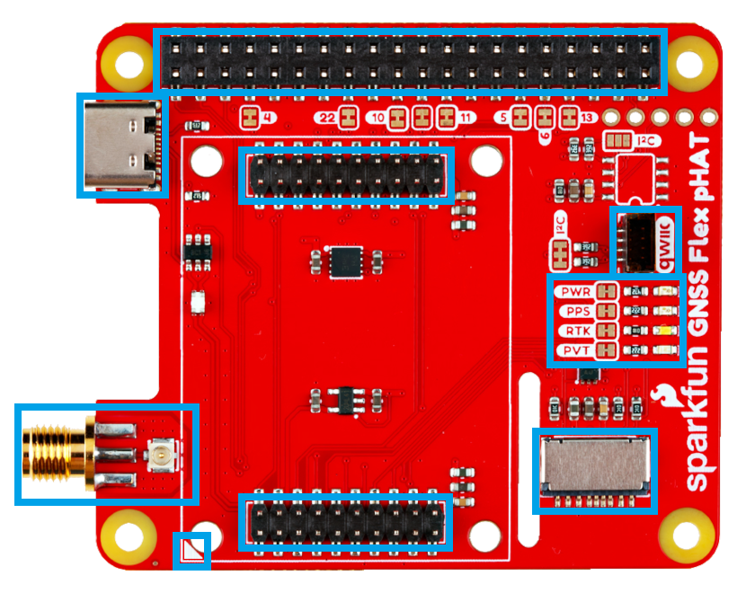

!!! info "pHAT (not HAT+)"
	This is product does not completely meet Raspberry Pi's HAT+ specification.

	- An identification EEPROM is not populated on the board; however, we do provide a footprint for future use.
	- Without an ID EEPROM, a Raspberry Pi cannot automatically identify this board. Therefore, users will need to manually [install any software](software_overview.md) and provide configurations for the [hardware connections](#40-pin-gpio-header).

## Introduction
The SparkFun GNSS Flex pHAT is a Raspberry Pi pHAT that functions as a *carrier board* for our SparkPNT GNSS Flex modules. With pre-soldered headers, no soldering is required to stack the pHAT on the headers of a Raspberry Pi, NVIDIA Jetson Nano, Google Coral, or other single-board computer with a similar 40-pin header.

The GNSS Flex pHAT also comes populated with two sets of 2x10 pin, 2mm pitch male headers for attaching a GNSS Flex module. With these headers, the GNSS Flex system is designed to be modular so that boards are pin-compatible for upgrades and can be easily swapped for repairs. Depending on the capabilities of the GNSS Flex module that is connected, these pins will breakout the USB, UART (x4), I2C, and SD card interfaces for the GNSS receiver along with any PPS or event signals, using a standardized pin out.

## Design Files

<!-- Import the component -->

<!-- Material color adjustment (for soldermask) -->

-   :kicad-primary:{ .enlarge-logo } **Design Files**

	---

	- :fontawesome-solid-file-pdf: [Schematic](./assets/board_files/schematic.pdf)
	- :material-folder-zip: [KiCad Files](./assets/board_files/kicad_files.zip)
	- :material-rotate-3d: [STEP File](./assets/3d_model/cad_model.step)
	- :fontawesome-solid-file-pdf: [Board Dimensions](./assets/board_files/dimensions.pdf):

	 

	**Hardware Included w/ Kit**

	---

	- x1 - SparkPNT GNSS Flex Module
	- x1 - [Tall GPIO Female Headers - 2x20 Pin](https://www.sparkfun.com/tall-gpio-female-headers-2x20-pin.html)
	- x1 - 50mm U.FL to U.FL Cable
	- x4 - Aluminum Hex Standoff
		- Thread: M2.5-0.45; Length: 16mm
	- x8 - Phillips Machine Screw
		- Thread: M2.5-0.45x8mm

-   <!-- Boxes in tabs -->

	=== "3D Model"
		<article style="text-align: center;" markdown>
		<model-viewer src="../assets/3d_model/web_model.glb" camera-controls poster="../assets/3d_model/poster.png" tone-mapping="neutral" shadow-intensity="2" shadow-softness="0.2" camera-orbit="0deg 75deg 0.1623m" field-of-view="25.11deg" style="width: 100%; height: 450px;">
		</model-viewer>
		</article>

		???+ tip "Manipulate 3D Model"
			<article style="text-align: center;" markdown>

			| Controls       | Mouse                    | Touchscreen    |
			| :------------- | :----------------------: | :------------: |
			| Zoom           | Scroll Wheel             | 2-Finger Pinch |
			| Rotate         | ++"Left-Click"++ & Drag  | 1-Finger Drag  |
			| Move/Translate | ++"Right-Click"++ & Drag | 2-Finger Drag  |

			</article>

	=== "Dimensions"
		<article style="text-align: center;" markdown>
		[{ width="400" }](./assets/board_files/dimensions.png "Click to enlarge")
		<figcaption markdown>Dimensions of the GNSS Flex pHAT.</figcaption>
		</article>

		???+ tip "Need more measurements?"
			For more information about the board's dimensions, users can download the [KiCad files](./assets/board_files/kicad_files.zip) for this board. These files can be opened in KiCad and additional measurements can be made with the measuring tool.

			!!! info ":octicons-download-16:{ .heart } KiCad - Free Download!"
				KiCad is free, open-source [CAD]("computer-aided design") program for electronics. Click on the button below to download their software. *(\*Users can find out more information about KiCad from their [website](https://www.kicad.org/).)*

				<article style="text-align: center;" markdown>
				[Download :kicad-primary:{ .enlarge-logo }](https://www.kicad.org/download/ "Go to downloads page"){ .md-button .md-button--primary }
				</article>

			???+ info ":straight_ruler: Measuring Tool"
				This video demonstrates how to utilize the dimensions tool in KiCad, to include additional measurements:

				<article style="text-align: center;" markdown>
				<article class="video-500px">
				<iframe src="https://www.youtube.com/embed/-eXuD8pkCYw" title="KiCad Dimension Tool" frameborder="0" allow="accelerometer; autoplay; clipboard-write; encrypted-media; gyroscope; picture-in-picture" allowfullscreen></iframe>
				</article>
				{ .qr }
				</article>

## Board Layout
The GNSS Flex system is designed around two 2x10-pin, 2mm pitch headers used mate the two types of boards. A standardized pin layout, keeps the ecosystem pin-compatible for upgrades and allows board to be easily swapped for repairs. Depending on the capabilities of the GNSS receiver, these pins will breakout the UART (x4), I2C, and SD card interfaces along with any PPS or event signals of the GNSS receiver.

<figure markdown>
[{ width="400" }](./assets/img/hookup_guide/layout.png "Click to enlarge")
<figcaption markdown>Layout of the major components of the GNSS Flex pHAT.</figcaption>
</figure>

The GNSS Flex pHAT has the following features:

1. **40-pin GPIO Header**
:	The 2x20 pin, 0.1" pitch female header for stacking the pHAT on top the Raspberry Pi's 40-pin GPIO header.
1. **GNSS Flex Headers**
:	Two sets of 2x10 pin, 2mm pitch female headers for connecting a GNSS Flex module.
1. **Alignment Indicator**
: Used to indicate the board alignment of a GNSS Flex module.
1. **Antenna Bridge**
:	U.FL and SMA connectors for attaching an external GNSS antenna.
1. **Status LEDs**
: Four status indication LEDs for the pHAT and attached GNSS Flex module.
1. **USB-C Connector**
:	A USB connector that breaks out the USB interface of an attached GNSS Flex module.
1. **SD Card Slot**
: Depending on the capabilities of the GNSS Flex module, a &micro;SD card slot for data logging.
1. **Qwiic Connector**
: A Qwiic connector for attaching peripheral devices to the I2C bus.

## Antenna Bridge
The SMA connector provides users with a more robust interface for attaching an external GNSS antenna. With the U.FL and SMA connectors bridged together and their ground plane isolated from the rest of the board, this allows users to pass the antenna connection from the GNSS Flex module to the GNSS Flex pHAT.

<figure markdown>
[{ width="400" }](./assets/img/hookup_guide/ant_bridge.png "Click to enlarge")
<figcaption markdown>An SMA antenna bridge on the GNSS Flex pHAT, which provides a more robust connection.</figcaption>
</figure>

## 40-pin GPIO Header
In its simplest form, the SparkFun GNSS Flex pHAT sits atop a Raspberry Pi interfacing with its 40-pin header.

<figure markdown>
[{ width="400" }](./assets/img/hookup_guide/headers-raspberry_pi.png "Click to enlarge")
<figcaption markdown>The 40-pin female GPIO header for attaching to an SBC.</figcaption>
</figure>

### Interfaces
The following interfaces and signals of the GNSS Flex system are connected to the 40-pin female GPIO header of the GNSS Flex pHAT. Below, are tables detailing the pin connections for each interface.

=== "UART"

	

	

	=== "UART1"
		<article style="text-align: center;" markdown>

		| GNSS Flex Pin| Raspberry Pi GPIO |
		| :---: | :---------------- |
		| `RX1` | `GPIO14` *(`TX`)* |
		| `TX1` | `GPIO15` *(`RX`)* |

		</article>

	=== "UART2"
		<article style="text-align: center;" markdown>

		| GNSS Flex Pin| Raspberry Pi GPIO |
		| :----: | :------------------- |
		| `RX2`  | `GPIO08` *(`CE0`)*   |
		| `TX2`  | `GPIO09` *(`POCI0`)* |
		| `RTS2` | `GPIO10` *(`PICO0`)* |
		| `CTS2` | `GPIO11` *(`SLK0`)*  |

		</article>

	=== "UART3"
		<article style="text-align: center;" markdown>

		| GNSS Flex Pin| Raspberry Pi GPIO |
		| :----: | :------------------- |
		| `RX3`  | `GPIO04` *(`GCLK0`)* |
		| `TX3`  | `GPIO05` *(`GCLK1`)* |
		| `RTS3` | `GPIO06` *(`GCLK2`)* |
		| `CTS3` | `GPIO07` *(`CE1`)*   |

		</article>

	=== "UART4"
		<article style="text-align: center;" markdown>

		| GNSS Flex Pin| Raspberry Pi GPIO |
		| :---: | :------------------ |
		| `RX4` | `GPIO12` *(`PMW0`)* |
		| `TX4` | `GPIO13` *(`PMW1`)* |

		</article>

	

	

	<figure markdown>
	[{ width="650" }](./assets/img/hookup_guide/gpio-uart.png "Click to enlarge")
	<figcaption markdown>The pin connections of the UART interface, from the GNSS Flex system to the 40-pin female GPIO header.</figcaption>
	</figure>

	

	

=== "I2C"

	

	

	<article style="text-align: center;" markdown>

	| GNSS Flex Pin| Raspberry Pi GPIO |
	| :---: | :------------------ |
	| `SDA` | `GPIO02` *(`SDA`)* |
	| `SCL` | `GPIO03` *(`SCL`)* |

	</article>

	

	

	<figure markdown>
	[{ width="650" }](./assets/img/hookup_guide/gpio-i2c.png "Click to enlarge")
	<figcaption markdown>The pin connections of the I2C interface, from the GNSS Flex system to the 40-pin female GPIO header.</figcaption>
	</figure>

	

	

=== "PPS"

	

	

	<article style="text-align: center;" markdown>

	| GNSS Flex Pin| Raspberry Pi GPIO |
	| :----: | :------- |
	| `PPS1` | `GPIO22` |
	| `PPS2` | `GPIO23` |

	</article>

	

	

	<figure markdown>
	[{ width="650" }](./assets/img/hookup_guide/gpio-pps.png "Click to enlarge")
	<figcaption markdown>The pin connections of the PPS signals, from the GNSS Flex system to the 40-pin female GPIO header.</figcaption>
	</figure>

	

	

=== "Event"

	

	

	<article style="text-align: center;" markdown>

	| GNSS Flex Pin| Raspberry Pi GPIO |
	| :------: | :------- |
	| `EVENTA` | `GPIO24` |
	| `EVENTB` | `GPIO25` |

	</article>

	

	

	<figure markdown>
	[{ width="650" }](./assets/img/hookup_guide/gpio-event.png "Click to enlarge")
	<figcaption markdown>The pin connections of the event triggers, from the GNSS Flex system to the 40-pin female GPIO header.</figcaption>
	</figure>

	

	

## LEDs
There are four status LEDs on the GNSS Flex pHAT:

<figure markdown>
[{ width="400" }](./assets/img/hookup_guide/LEDs.png "Click to enlarge")
<figcaption markdown>The status LED indicators on the GNSS Flex pHAT.</figcaption>
</figure>

- `PWR` - Power *(Red)*
	- Turns on once power is supplied to the board from the 40-pin GPIO header
- `PPS` - Pulse-Per-Second *(Yellow)*
	- Indicates when there is a pulse-per-second signal from the GNSS Flex module
- `RTK` - RTK *(White)*
	- Usually indicates when an RTK fix has been established or when the correct RTCM data is being received by the GNSS Flex module
- `PVT` - PVT *(Blue)*
	- Usually, indicates when an GNSS lock or a position fix has been established by the GNSS Flex module

## USB Connector
Depending on the capabilities of the GNSS receiver, the USB connector breaks out the USB interface from the GNSS Flex module.

<figure markdown>
[{ width="400" }](./assets/img/hookup_guide/usb.png "Click to enlarge")
<figcaption markdown>The USB connector on the GNSS Flex pHAT.</figcaption>
</figure>

## SD Card Slot
Depending on the capabilities of the GNSS receiver, the &micro;SD card slot can be used for data logging.

<figure markdown>
[{ width="400" }](./assets/img/hookup_guide/sd_card.png "Click to enlarge")
<figcaption markdown>The SD card slot on the GNSS Flex pHAT.</figcaption>
</figure>

## Qwiic Connector
The Qwiic connector attached to the primary I2C interface of the 40-pin GPIO header.

<figure markdown>
[{ width="400" }](./assets/img/hookup_guide/qwiic.png "Click to enlarge")
<figcaption markdown>The Qwiic connector on the GNSS Flex pHAT.</figcaption>
</figure>

## Jumpers
There are twenty-three jumpers on the GNSS Flex pHAT:

<figure markdown>
[{ width="400" }](./assets/img/hookup_guide/jumpers-top.png "Click to enlarge")
<figcaption markdown>Jumpers on the top of the GNSS Flex pHAT.</figcaption>
</figure>

<figure markdown>
[{ width="400" }](./assets/img/hookup_guide/jumpers-bottom.png "Click to enlarge")
<figcaption markdown>Jumpers on the bottom of the GNSS Flex pHAT.</figcaption>
</figure>

- The `SHLD` jumper can be cut to isolate the shielding of the USB-C connector from the ground plane of the board.
- All the jumpers labeled with numbers, can be cut tp disconnect a signal from the GNSS Flex header to the associated Raspberry Pi GPIO pin *(refer to the [40-pin GPIO Header section](#40-pin-gpio-header))*.
- All the jumpers next to the status LEDs, can be cut to disable the associated LED.
- There are two `I2C` jumpers; one next to the Qwiic connector and one next to the unpopulated EEPROM footprint.
	- The `I2C` jumper next to the Qwiic connector, can be cut to disconnect the two 3.9k&ohm; pull-up resistors for that I2C bus.
	- The `I2C` jumper next to the EEPROM footprint, can be closed to connect two 3.9k&ohm; pull-up resistors if an EEPROM is populated.
