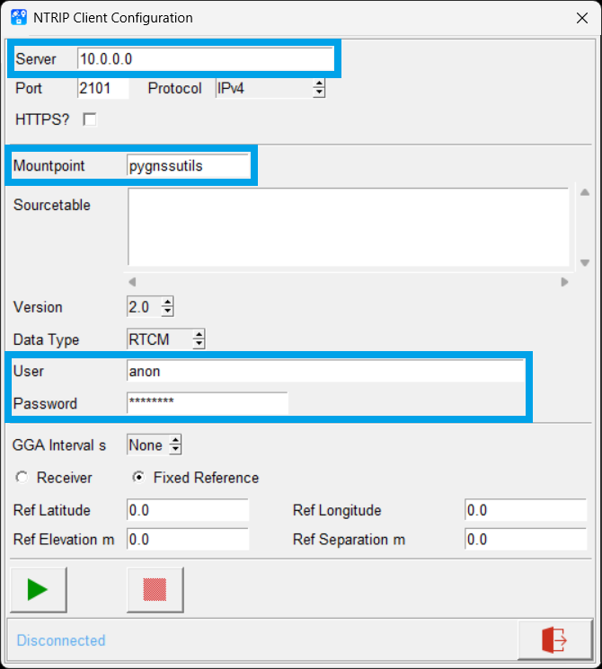
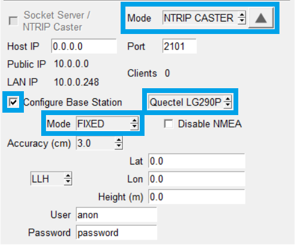
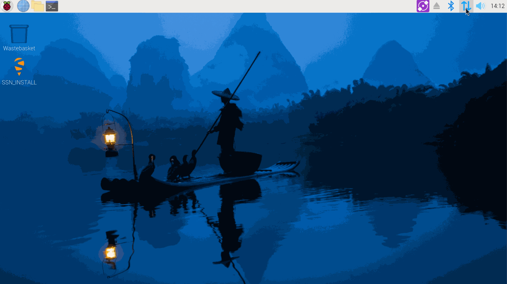
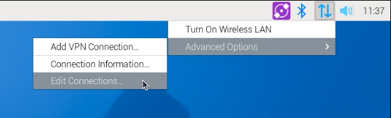
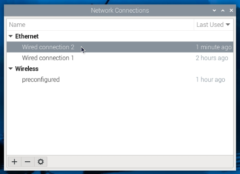

!!! warning "Warning - Resource Requirements"
	When choosing a SBC, please be aware of any resource requirements.

	For example, the mosaic-X GNSS Flex module provides an internal web server, which can be utilized to change its configuration settings. On platforms such as the Raspberry Pi, using the latest Raspberry Pi OS *(Bookworm, at the time of writing)*, the Chromium web browser requires a good amount of RAM to run smoothly. Therefore, some of the older Raspberry Pi models become extremely sluggish to work with.


## Supported Platforms
There are dozens of single board computers (SBCs) to choose from; we have tested this hardware with the Raspberry Pi and Nvidia platforms using their latest OS distributions *(Bookworm and JetPack 6.2)*. To use the SparkFun GNSS Flex pHAT on other platforms, the SBC must have a compatible 40-pin GPIO header that follows Raspberry Pi's standardized pin layout.


???+ tip "Tip - Hardware Recommendations"
	We highly recommend using the Raspberry Pi 4B/5 and latest Nvidia Jetson Orin Nano. While users are free to use other boards or platforms, we cannot guarantee the functionality of our recommended software for those instances.

	- **Jetson Orin Nano (super)** - Tested and verified
	- **Jetson Nano (4GB)** - Tested and verified
	- **Pi 5** - Tested and verified with 4GB version
	- **Pi 4B** - Tested and verified with 2GB and 4GB versions; would recommend avoiding the 1GB version due to the web browser requirements
	- **Pi Zero 2W** - Tested and verified; would recommend avoiding due to the web browser requirements
	- **Pi 3A+** - Tested and verified; would recommend avoiding due to the web browser requirements
	- **Pi 3B+** - Tested and verified
	- **Pi 3B** - Tested and verified; would recommend avoiding due to limitations in processing power
	- **Pi Zero/Zero W** - Avoid

	---

	**PyGPSClient**

	The `PyGPSClient` software that we recommend below, provides a nice graphical user interface for the GNSS Flex modules. However, as with any GUI, it requires a decent amount of computational resources to run smoothly.

	- Users can try using the **Pi Zero 2W**, but just be aware that we noticed a small degree of lag in the GUI.
	- Just avoid using the **Pi 3B** (or older) and **Pi Zero/Zero W** models.


	**mosaic-X5 Web Server**

	The mosaic-X GNSS Flex module provides an internal web server, which can be utilized to change its configuration settings. However, when using the latest Raspberry Pi OS *(Bookworm)*, the Chromium browser requires a decent amount of RAM to function. For this reason, we recommend using any Pi 4B or later model, with **at least 2GB of RAM**.

	Save yourself the trouble and just avoid using the following Raspberry Pi boards:

	- Users can try using the **Pi 3B+** model, but it will require a significant amount of patience waiting for a web page to load. The web page needs to reload each time users change a setting; and again, to save the settings.
	- Just avoid using the **Pi 3B/A+** (or older) and **Pi Zero/Zero W/Zero 2W** models


## Getting Started with your SBC
For users unfamiliar with the following platforms, we have linked additional resources below:


<div class="grid cards" markdown>

- ### Raspberry Pi OS

	---

	- [Raspberry Pi Imager](https://www.raspberrypi.com/software/)
	- [Operating System Images](https://www.raspberrypi.com/software/operating-systems/)
	- [Raspberry Pi Documentation](https://www.raspberrypi.com/documentation/)
		- [Getting Started](https://www.raspberrypi.com/documentation/computers/getting-started.html)
			<center>
			{ .qr }
			<article class="video-500px">
			<iframe src="https://www.youtube.com/embed/CQtliTJ41ZE" title="How to set up a Raspberry Pi" frameborder="0" allow="accelerometer; autoplay; clipboard-write; encrypted-media; gyroscope; picture-in-picture" allowfullscreen></iframe>
			</article>
			</center>
		- [Raspberry Pi OS](https://www.raspberrypi.com/documentation/computers/os.html#updating-and-upgrading-raspberry-pi-os)
		- [Configurations](https://www.raspberrypi.com/documentation/computers/configuration.html)


- ### Nvidia JetPack SDK

	---

	- [JetPack SDK](https://developer.nvidia.com/embedded/jetpack)
		- [NVIDIA SDK Manager Documentation](https://docs.nvidia.com/sdk-manager/)
	- [Getting Started with Jetson Developer Kits](https://developer.nvidia.com/embedded/learn/getting-started-jetson)
		- Jetson Orin Nano Super Developer Kit
			- [User Guide](https://developer.nvidia.com/embedded/learn/jetson-orin-nano-devkit-user-guide/index.html)
			- [Getting Started Guide](https://developer.nvidia.com/embedded/learn/get-started-jetson-orin-nano-devkit)
		- Jetson AGX Orin Developer Kit
			- [User Guide](https://developer.nvidia.com/embedded/learn/jetson-agx-orin-devkit-user-guide/index.html)
			- [Getting Started Guide](https://developer.nvidia.com/embedded/learn/get-started-jetson-agx-orin-devkit)
	- Support
		- [Jetson FAQ](https://developer.nvidia.com/embedded/faq)
		- [Jetson Linux Developer Guide](https://docs.nvidia.com/jetson/l4t/index.html)
		- [Jetson Community Resources](https://developer.nvidia.com/embedded/community/resources)
		- [Jetson Projects Forum](https://forums.developer.nvidia.com/c/agx-autonomous-machines/jetson-embedded-systems/jetson-projects)

</div>


## Update Software
Once users have got their SBC up and running, ensure that it is utilizing the latest software. Run the following commands to update and upgrade any installed packages:

```shell
sudo apt update
sudo apt full-upgrade
sudo apt autoremove --purge && sudo apt clean
```

!!! info
	[Advanced Package Tool (APT)](https://en.wikipedia.org/wiki/APT_(software)) is the recommended way to install, update, and remove software in Raspberry Pi OS. Users can access APT through the `apt` CLI.


## Enable Serial Interface
Depending on the SBC platform, users may need to enable access to the serial interface from the 40-pin GPIO header for the operating system.


### Configuration Settings
In the Raspberry Pi OS, users can enable access to the serial interface through the [`raspi-config`](https://www.raspberrypi.com/documentation/computers/configuration.html#raspi-config) configuration tool. The tool can be utilized through either the CLI or [desktop GUI](https://www.raspberrypi.com/documentation/computers/configuration.html#raspberry-pi-configuration). To change the configuration settings, users will need to navigate through the [Interface options](https://www.raspberrypi.com/documentation/computers/configuration.html#interfacing-options) > [Serial port](https://www.raspberrypi.com/documentation/computers/configuration.html#serial) menus and enable the serial port.


???+ note
	Not all of the advanced configuration options from the CLI are available in the Raspberry Pi Configuration GUI.


!!! tip "Disabling the Linux Serial Console"
	On the Pi 3/4/Zero 2W, users should keep [access to the shell disabled from the serial interface](https://www.raspberrypi.com/documentation/computers/configuration.html#disabling-the-linux-serial-console).


### User Privileges
To access the serial port on most Linux platforms, users will need to be a member of the `tty` and/or `dialout` groups. This can be configured with either the `adduser` or `usermod` utilities.

- [`adduser` Utility](https://manpages.ubuntu.com/manpages/xenial/man8/adduser.8.html)
	```shell
	sudo adduser <username> <groupname>
	```
- [`usermod` Utility](https://manpages.ubuntu.com/manpages/xenial/man8/usermod.8.html)
	```shell
	sudo usermod -aG <groupname> <username>
	```


## pyGPSClient
[PyGPSClient](https://github.com/semuconsulting/PyGPSClient) is a free, open-source graphical interface for GNSS receiver testing and evaluation. We recommend the software for the Raspberry Pi and other SBCs because it is supported on multiple operating systems.


!!! info "System Requirements"
	The installation requires an internet connection to download the Python package from PyPI. Additionally, users will also need administrative privileges *(or root access `sudo`)* for the installation and [access the hardware connections](#serial-interface). Other than this, no special privileges are required.


### Installation
There are a variety of [installation methods](https://github.com/semuconsulting/PyGPSClient?tab=readme-ov-file#installation) detailed in the GitHub repository's `README.md` file. However, we recommend utilizing either the [`pip` installation method](https://github.com/semuconsulting/PyGPSClient?tab=readme-ov-file#install-using-pip) or [installation shell script](https://github.com/semuconsulting/PyGPSClient?tab=readme-ov-file#install-using-installation-script---macos--64-bit-debian-based-linux-only).


#### Shell Script
[Installation instructions](https://github.com/semuconsulting/PyGPSClient?tab=readme-ov-file#install-using-installation-script---macos--64-bit-debian-based-linux-only) for the example shell scripts are detailed in the GitHub repository's `README.md` file.

<center>

[Example Installation Script](https://github.com/semuconsulting/PyGPSClient/blob/master/examples/pygpsclient_debian_install.sh){ .md-button .md-button--primary }

</center>


#### `pip` Installation
[Installation instructions](https://github.com/semuconsulting/PyGPSClient?tab=readme-ov-file#install-using-pip) for the `pip` installation method are detailed in the GitHub repository's `README.md` file. Depending on how Python is installed on the computer, one of the following commands should allow users to install the software:


``` shell
python3 -m pip install pygpsclient
```
``` shell
pip3 install pygpsclient
```


!!! tip "Jetson - Install `pip`"
	For the Jetson Orin Nano development kit, users will need to install `pip` before following the installation steps below.

	``` shell
	sudo apt install python3-pip
	```


!!! rpi "Pi OS - Bookworm"
	Starting with Raspberry Pi OS Bookworm, users can no longer install Python packages, via `pip`, directly into the system version of Python. Instead, Python packages must be installed into a Python virtual environment (`venv`); a container where third-party modules can be safely installed without interfering with the system version of Python.


### Virtual Environment
With the latest version of the Raspberry Pi OS, Bookworm, users will need to follow to the [instructions for utilizing a virtual environment](https://github.com/semuconsulting/PyGPSClient?tab=readme-ov-file#install-using-pip).


!!! warning
	Due to the nature of utilizing a virtual environment, these instructions will not function as a system wide installation. *(i.e. You'll only be able to access the application with the `<user>`, used to install the application in their virtual environment.)*


#### Create a Virtual Environment
To create a virtual environment, in a specific `<directory>`:
```shell
python3 -m venv <directory>
```


!!! example
	Creating a virtual environment in the `env` directory:

	```shell
	python3 -m venv env
	```


#### Activate the Virtual Environment
To activate the virtual environment that was created in the `<directory>`:
```shell
source <directory>/bin/activate
```

- **Install the Application in the Virtual Environment**

	Once inside the virtual environment, users can install the Python package with the normal `pip` installation command:
	```shell
	python3 -m pip install pygpsclient
	```

- **Run the Application in the Virtual Environment**

	To run the application in the virtual environment:
	```shell
	pygpsclient
	```

!!! example
	To install and run the the Python package inside the `env` virtual environment:

	```shell
	source env/bin/activate
	python3 -m pip install pygpsclient
	pygpsclient
	```


#### Deactivate the Virtual Environment
To deactivate the virtual environment:
```shell
deactivate
```

- Once deactivated, the virtual environment can be reactivated with the activation command:
	```shell
	source <directory>/bin/activate
	```
- To reactivate and run the Python package in the virtual environment:
	```shell
	source <directory>/bin/activate
	pygpsclient
	```

	!!! example
		```shell
		source env/bin/activate
		pygpsclient
		```


### Enable User Port
In certain circumstances, users may need to manually configure the serial port for the application to function.

- **Pi 3/4/Zero 2W:**
	```shell
	sudo pygpsclient ---userport /dev/ttyS0
	```
- **Pi 5:**
	```shell
	sudo pygpsclient ---userport /dev/ttyAMA0
	```


### Launch Options
While not required to operate the `PyGPSClient` software, user have additional options for how the Python package is executed.

- To operate the software outside of a virtual environment, users can add the directory of the software's binaries to the `PATH` variable.
- To utilize the software without an open terminal to be open, users can create a desktop application launcher.


#### Locate Relevant Binaries
The location of the relevant binaries folder can usually be found by executing one of the following commands:

- If the package was installed in the virtual environment, activate it:
	```shell
	source <directory>/bin/activate
	```
- For a global installation, execute the following command:
	```shell
	python3 -c "import os,sysconfig;print(sysconfig.get_path('scripts'))"
	```
	The system should return the following directory for the relevant binaries, in a virtual environment:
	```shell
	/home/<user>/<directory>/bin
	```
- Deactivate, if inside a virtual environment:
	```shell
	deactivate
	```


!!! example
	For a virtual environment, to find the directory of the relevant binaries execute the following commands:

	```shell
	source env/bin/activate
	python3 -c "import os,sysconfig;print(sysconfig.get_path('scripts'))"
	deactivate
	```


<!-- Not a user installation!
Then, execute the following command for a user installation:
```shell
python3 -c "import os,sysconfig;print(sysconfig.get_path('scripts',f'{os.name}_user'))"
```

The system should return the following directory for the relevant binaries:
```shell
/home/<user>/.local/bin
```
-->


#### Add to `PATH` Variable
To make the Python package accessible outside of the virtual environment, the directory of the relevant binaries need to be added to the `PATH` variable:

```shell
export PATH="$PATH:<directory to relevant binaries>"
source ~/.profile
```


!!! example
	```shell
	export PATH="$PATH:/home/pi/env/bin"
	source ~/.profile
	```


Once added, the application should now be available outside of the virtual environment:
```shell
pygpsclient
```


<!-- Not a user installation!
!!! example
	```shell
	export PATH="$PATH:/home/<user>/.local/bin"
	```

	```shell
	export PATH="$PATH:~/.local/bin"
	```
-->


<!-- Application is not available system wide
```shell
source /etc/environment
```

```shell
source /etc/profile
```
-->


#### Application Launcher
In addition to the previous sections, users can [follow these instructions](https://github.com/semuconsulting/PyGPSClient/blob/master/APPLAUNCH.md) to create an application launcher.

1. Create a text file named `pygpsclient.desktop` with the following content and save it in the `/home/<user>/.local/share/applications` directory.

	```bash
	[Desktop Entry]
	Type=Application
	Terminal=false
	Name=PyGPSClient
	Icon=/home/<user>/.local/lib/<python version>/site-packages/pygpsclient/resources/pygpsclient.ico
	Exec=/home/<user>/.local/bin/pygpsclient
	```


	!!! example
		```bash
		[Desktop Entry]
		Type=Application
		Terminal=false
		Name=PyGPSClient
		Icon=/home/pi/.local/lib/python3.13/site-packages/pygpsclient/resources/pygpsclient.ico
		Exec=/home/pi/.local/bin/pygpsclient
		```


	!!! tip
		Users can also validate the file, with the following command:

		```shell
		desktop-file-validate <file_name>.desktop
		```


1. Logout and back in for the changes to take effect.


### NTRIP Client

<div class="grid" markdown>

<div markdown>

<figure markdown>
[{ width="400" }](./assets/img/hookup_guide/pygpsclient-ntrip_client.png "Click to enlarge")
<figcaption markdown>Configuration settings for connecting to an NTRIP client.</figcaption>
</figure>

</div>


<div markdown>

To receive and process NTRIP RTK correction data from an NTRIP server in the PyGPSClient software, users can follow [these instructions](https://github.com/semuconsulting/PyGPSClient?tab=readme-ov-file#ntrip-client-facilities):

1. Click on the :material-satellite-uplink: icon, labeled `NTRIP Client`.
1. Enter the information for the network and mount point.
	- For an NTRIP server hosted by the `PyGPSClient` software:
		- **Server:** IP address of Pi
		- **Port:** `2101`
		- **Mountpoint:** `pygnssutils`
		- **User:** `anon`
		- **Password:** `password`
1. Click on the :material-play: icon to connect to the server.

</div>

</div>


### NTRIP Server

<div class="grid" markdown>

<div markdown>

<figure markdown>
[{ width="400" }](./assets/img/hookup_guide/pygpsclient-ntrip_server.png "Click to enlarge")
<figcaption markdown>Configuration settings for an NTRIP caster.</figcaption>
</figure>

</div>


<div markdown>

If their GNSS receiver is supported by NTRIP sever feature of the PyGPSClient software, users can follow [these instructions](https://github.com/semuconsulting/PyGPSClient?tab=readme-ov-file#socket-server--ntrip-caster-facilities) to setup their Raspberry Pi to operate as an NTRIP sever:

1. In the settings console, scroll to the bottom and select `NTRIP CASTER` from the **Mode** drop-down menu.
1. Select the box for `Configure Base Station` and select the GNSS receiver from the drop-down menu.
1. Select a mode of operation for the base station and provide the necessary information.
1. Select the box for `Socket Server/NTRIP Caster`.

</div>

</div>


## mosaic-X5 - Internet Access
In order to receive or cast RTK corrections to/from a RTK network, such as NTRIP, the mosaic-X5 GNSS receiver will need access to the internet through the USB interface.

- Users will need to use the web interface to enable the `Outgoing Internet Access Over USB` from the **Communication** > **USB** drop-down menu of the navigation tabs.

	<center>
	<article class="video-500px">
	<iframe src="https://www.youtube.com/embed/bUt8cL9Ue1Y" title="Septentrio: Share internet connection with your GNSS / GPS receiver over USB" frameborder="0" allow="accelerometer; autoplay; clipboard-write; encrypted-media; gyroscope; picture-in-picture" allowfullscreen></iframe>
	</article>
	</center>

- This also requires users to configure a [network bridge](https://en.wikipedia.org/wiki/Network_bridge) on the Raspberry Pi.
	<figure markdown>
	[{ width="400" }](./assets/img/hookup_guide/pi-network_configuration.gif "Click to enlarge")
	<figcaption markdown>Editing the network connections to create a network bridge.</figcaption>
	</figure>
	1. Open the network connections menu by opening the network manager (i.e. &uarr;&darr; or :fontawesome-solid-wifi: icon on taskbar) and selecting **Advanced Options** > **Edit Connections**.
		<figure markdown>
		[{ width="400" }](./assets/img/hookup_guide/pi-network_manager.png "Click to enlarge")
		<figcaption markdown>Editing the connections through the Raspberry Pi's **Network Manager**.</figcaption>
		</figure>
	1. Check the wired connections under **Ethernet** to locate the connection that lists **Device:** `usb0 ....` in its properties.
		<figure markdown>
		[{ width="400" }](./assets/img/hookup_guide/pi-network_connections.png "Click to enlarge")
		<figcaption markdown>Check the connections listed under **Ethernet**.</figcaption>
		</figure>
	1. For that network connection, select the **IP v4 Settings** tab and select `Shared to other computers` from the **Method** drop-down menu.
	1. Click **Save** to apply the changes.
	1. Reboot the Raspberry Pi.
	1. To determine the new IP address assigned to the mosaic-X5, click on network manager and select **Advanced Options** > **Connection Information**. Locate the IP address listed for the same wired connection.


		!!! info "New IP Address"
			Once a network bridge is enabled, the receiver will receive its IP address from the computer's DHCP server. Depending on the routing table, the module may no longer be reachable at its default IP address *(`192.168.3.1`)*.

			If users need to determine the subnet address of the network connection, they need to install a tool called `nmap`.
			```bash
			sudo apt install nmap -y
			```
			In a terminal enter the following command to determine IP address.
			```bash
			nmap <IP Address>/24
			```

			- With the `*/24` option, the program will scan all the **Class C** subnet addresses (i.e. from `A.B.C.x` through `A.B.C.255`)


		!!! tip
			If the mosaic is still not connecting, try resetting it. The assigned IP should not change after it has booted.
